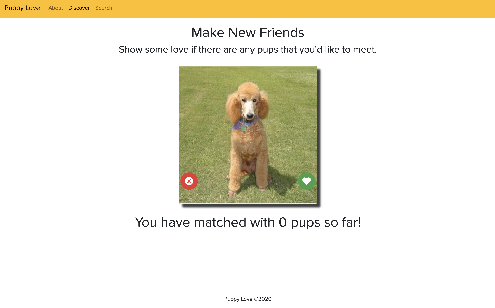
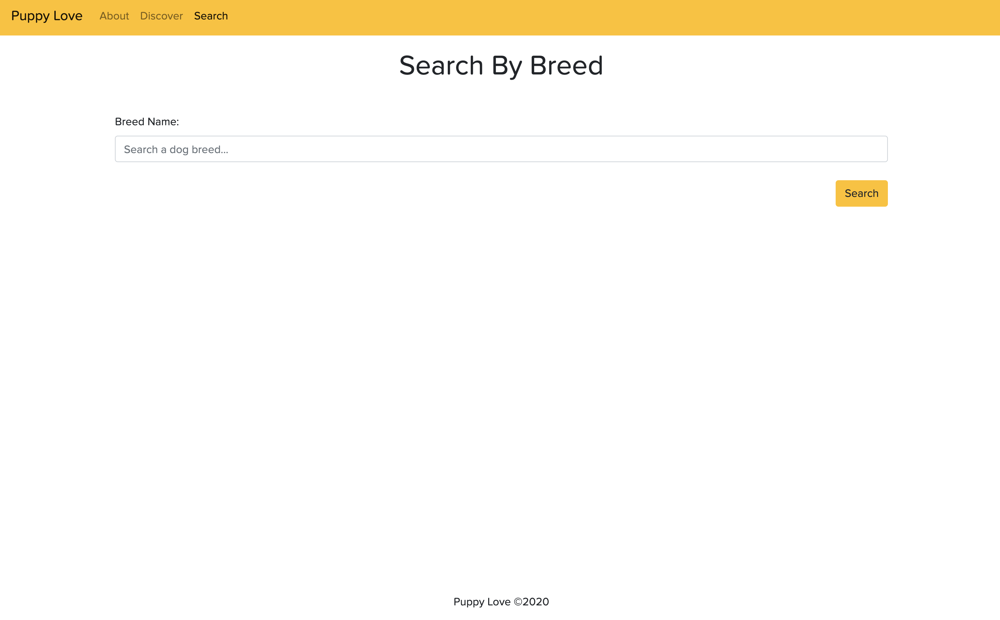

# Puppy Love

[](https://opensource.org/licenses/MIT)

## Table of Contents

- [Description](#description)
- [User Story](#user-story)
- [Features of the Application](#features-of-the-application)
- [Preview of Puppy Love](#preview-of-puppy-love)
- [Links](#links)
- [Installation](#installation)
- [Usage](#usage)
- [Built Using](#built-using)
- [License](#license)
- [Contributing](#contributing)
- [Questions](#questions)

## Description

Puppy Love is a responsive, dynamic social application that allows the user to discover new pups by sifting through numerous photos (by liking or disliking them) and, hopefully, make new friends through a "match".

Puppy Love holds three routes: About, Discover, and Search. The About page is a static welcome screen for visitors to the application. The Discover page displays a photo of a random dog and contains two clickable buttons: one for passing or "x-ing" a dog, and one for picking or "heart-ing" a dog. When either button is clicked, a new dog image is loaded. If a user "hearts" a dog, there is a chance that the dog likes them too and the count will go up by 1. The Search page allows users to search for all dogs by their breed. After a search is made, a list of all of the results appears underneath.

Puppy Love is a React application that utilizes Express routing, dynamic routing with react-router-dom and AJAX requests. Puppy Love utilizes the Dog Ceo API to display random dog images and allows the user to search for additional dog images by breed.

## User Story

```
AS A user
I WANT to discover new pups by sifting through photos
SO THAT I can find a "match" and make new friends.
```

## Features of the Application

```
GIVEN a social application
WHEN I click on the button to pass or pick a dog
THEN a new dog image is loaded.

WHEN I "heart" a dog
THEN there is a chance that I will have matched with that dog.

WHEN I search for a dog by their breed
THEN images of that dog breed will appear underneath the search form.
```

## Preview of Puppy Love






## Links

- [Deployed Application](https://puppy-love.onrender.com)

- [Github Repository](https://github.com/rh9891/PuppyLove)

## Installation

The application requires the following dependencies and/or package managers:

```
$ npm install axios react-router-dom
```

When downloaded, the application requires the input of `npm install` into the command line interface in order to download the contents of the `package.json`.

## Usage

The application can be initiated by inputting `npm start` into the command line interface and running the application on `localhost: 3000`.

## Built Using

Listed below are the frameworks, libraries, and guides that made building this application possible:

- [Axios](https://github.com/mzabriskie/axios)
- [Bootstrap](https://getbootstrap.com/docs/4.5/getting-started/introduction/)
- [Dog Ceo API](https://dog.ceo/dog-api/)
- [React](https://reactjs.org/docs/getting-started.html)
- [React Router](https://reacttraining.com/react-router/web/guides/philosophy)

## License

The MIT License (MIT)

Copyright (c) 2020 Romie Hecdivert

Permission is hereby granted, free of charge, to any person obtaining a copy of this software and associated documentation files (the "Software"), to deal in the Software without restriction, including without limitation the rights to use, copy, modify, merge, publish, distribute, sublicense, and/or sell copies of the Software, and to permit persons to whom the Software is furnished to do so, subject to the following conditions:

The above copyright notice and this permission notice shall be included in all copies or substantial portions of the Software.

THE SOFTWARE IS PROVIDED "AS IS", WITHOUT WARRANTY OF ANY KIND, EXPRESS OR IMPLIED, INCLUDING BUT NOT LIMITED TO THE WARRANTIES OF MERCHANTABILITY, FITNESS FOR A PARTICULAR PURPOSE AND NONINFRINGEMENT. IN NO EVENT SHALL THE AUTHORS OR COPYRIGHT HOLDERS BE LIABLE FOR ANY CLAIM, DAMAGES OR OTHER LIABILITY, WHETHER IN AN ACTION OF CONTRACT, TORT OR OTHERWISE, ARISING FROM, OUT OF OR IN CONNECTION WITH THE SOFTWARE OR THE USE OR OTHER DEALINGS IN THE SOFTWARE.

## Contributing

If you would like to contribute to this repository, please contact me via [Github](https://github.com/rh9891).

## Questions

If you have any questions, comments, or issues regarding this application, please do not hesitate to contact me via [Github](https://github.com/rh9891).
